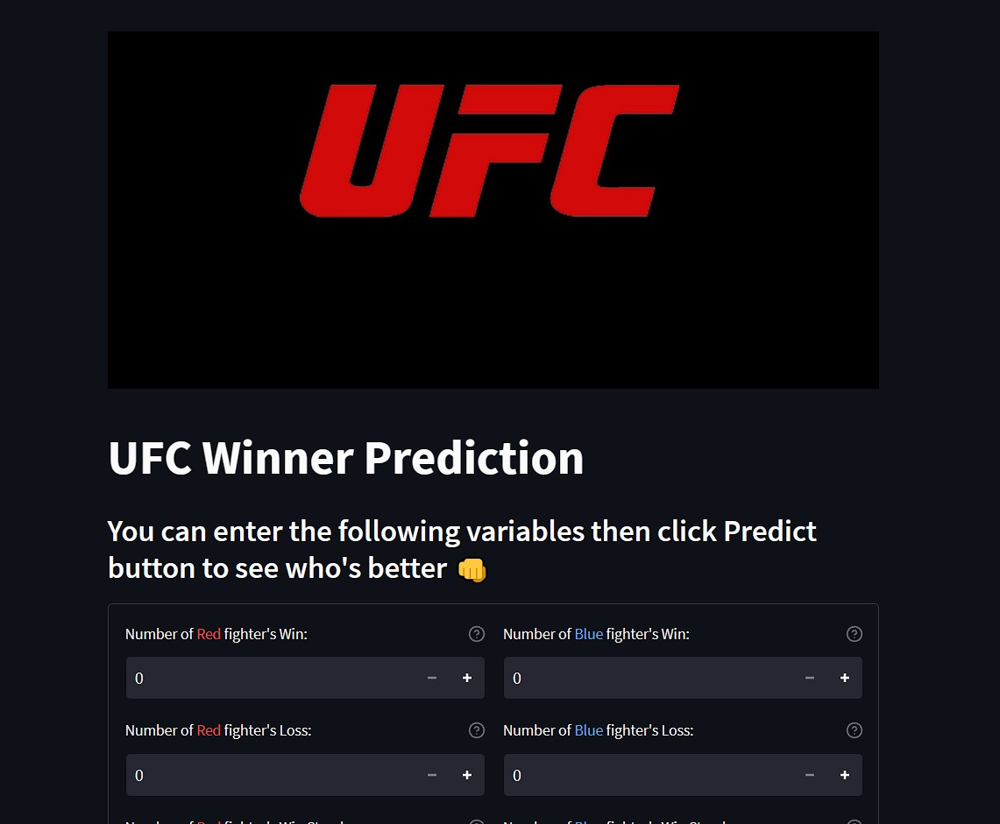
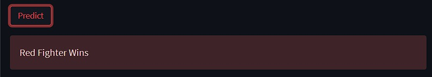
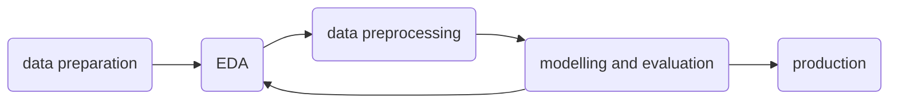
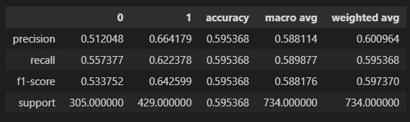
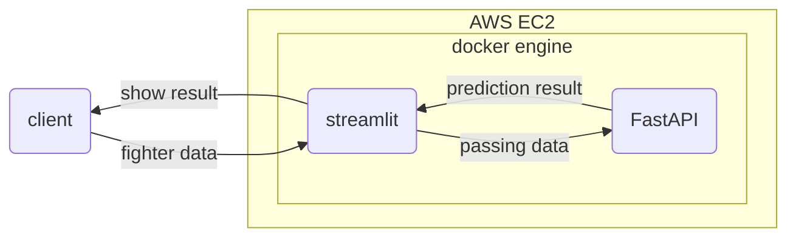
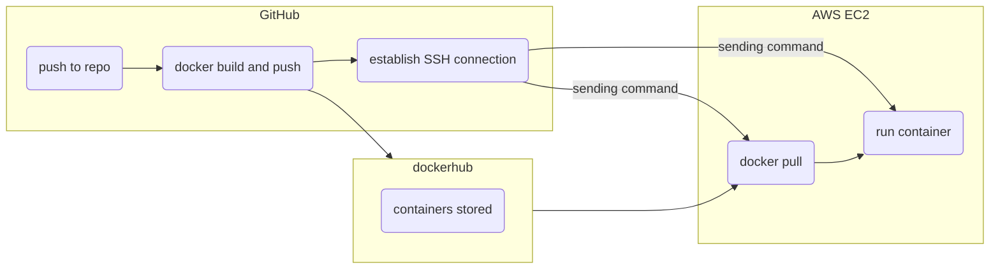

# UFC Winner Binary Classification

A web app serving binary classification model to predict the winner of a UFC fight based on fighters' characteristics, developed to be deployable to an EC2 AWS.

This project is to see if a UFC fight winner can be determined solely by the fighter's 'innate' chracteristics (e.g. physical and experience attributes). If such relationship can be found in our data, it would be beneficial to athletes and coaches to strategize their training and fight preparation.

As mentioned above, this project is not meant to find the most yielding betting strategy or any tool for gambling problem. Please do not use this app for those needs.

There will be three sections in the README, first we will take a look at the web app and how to use it. Then we will learn more about the data and the model in the following section. Lastly, we will see the stack of the app.

## Usage: How it works

The app is developed to be deployed to AWS EC2, and currently inactive for the sake of efficiency. Let me know if you are interested in trying the app over the web.

(The app also can be served locally but first you have to change the addresses in the source code)

To access the app, you can access the corresponding address and port (since there is no domain attached currently). You will find the following page.

You can insert the value for each fighter's characteristics. After that click on _predict_ button, and the corner colour of the winner would be displayed.

_To reiterate, this app is not meant to be used for gambling/betting. Use at your own risk._

## Model: Data, Features, Fitting, and Evaluation

The data used in the project was curated from project [Tiger Millionaire](https://github.com/shortlikeafox/tiger-millionaire).

Our dataset has 4896 records with 114 features, most of them are fighters' stat (numeric) but some are of categorical type such as location and fighters' names. For more information about about this section, you can always look into the corresponding Jupyter Notebook.

To explain the ML workflow simply, we can look into following flowchart.

To remark some points:

1. Because of the way matchmaking works in UFC, Red-Blue are not chosen randomly, but Red means the fighter is _Favourite_ and Blue means the fighter is _Underdog_.
2. Consequently, as we can see in our data Red has _more chance_ of winning than Blue. To be more precise, there is 58.395% probability of Red winning. This means if we take out prediction to be all Red then we would have roughly 58% accuracy. We will take this number as our _baseline_.
3. Because of unbalanced proportion, before modelling we _undersampled_ our data.
4. Training process are performed using several base model with the best performing one was _Logistic Regression_.
5. In this project, classification metric that we pay most of the attention to is (macro) _f1-score_ because we want the users (e.g. athletes or coaches) can determine whether they would really win or not, regardless of their corner's colour.

With considerations above, we get the following result:

<!--  -->

  
   
   (1 for Red, 0 for Blue) 

Result above says our model has 59.54% accuracy and 58.82% f1-score macro avg. This was a rather unsatisfying result. Again, it's important to note that our model prioritise f1-score when it was cross-validated. For our problem, high accuracy but low Blue precision (also resulting in low f1-score) means most of the prediction that Blue is the winner would be false, therefore it would mislead the Blue fighter which is harmful when they want to formulate fighting strategy.

Discussion about our result and attempts to make it better are available on `model-experimental` branch (`eda.ipynb` and `data_preprocessing.ipynb`). In short, our features are very weakly correlated to our target and our target label distribution over our features are overlapping.

## Application: Stack and Deployment

Overview of our app is as below.

Note:

1. Our services (FastAPI and streamlit) are containerised separately (`docker-compose.yaml` needed).
2. FastAPI service are the one responsible for our prediction.
3. Docker needs to be installed first on EC2.

CI/CD are available following scheme below.

## Improvements

- Better features, possibly if there is a way to validly metricise mental it would be a great addition to our feature set according to this [paper](https://www.atlantis-press.com/proceedings/acpes-19/125921420).
